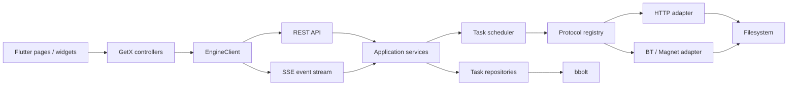

# Downpeed

Downpeed 是一款桌面优先、本地优先的跨平台下载管理器。项目采用 **Go 下载内核 + Flutter 客户端**：Go 负责协议、调度、持久化和文件操作，Flutter 负责原生感界面与桌面交互，两端通过版本化 REST API 和事件流通信。

> 当前状态：M0、M1、M2 与 M3 已完成，M4 已完成 Go 动态库与 Flutter FFI 生命周期桥接，并完成三平台系统托盘、关闭到托盘、开机启动、按偏好静默进入托盘和优雅退出闭环。桌面发布构建会将 Go 内核作为 `c-shared` 动态库嵌入应用，由 Flutter 负责启动、就绪探测与安全停止；开发模式仍可连接独立 Go 进程。BT/Magnet 已形成组件审查、安全解析、`.torrent + 显式公网 IPv4 Peer` 受限下载、按需连接诊断和内核策略闭环。用户可设置新 BT 任务的 Peer 连接预算；Tracker、DHT、PEX、WebSeed、IPv6、入站、上传和做种在完成各自安全门禁前由 Go 内核强制关闭。Magnet 当前仍只解析身份，不获取元数据或创建传输任务。

## 产品定位

- **桌面优先**：MVP 完整支持 macOS、Windows 和 Linux；移动端与 Web 端后续适配。
- **本地优先**：下载任务、配置和文件默认保存在本机，不要求账号和云端服务。
- **任务优先**：第一屏就是任务工作区，不做营销式首页和空洞数据大屏。
- **协议分层**：HTTP、BitTorrent 等协议实现独立适配器，不把协议判断散落在 UI 或调度器中。
- **透明可控**：清晰展示速度、连接、分段、剩余时间、错误原因和文件位置。
- **可扩展但克制**：先完成可靠下载闭环，再增加浏览器接管、远程控制和扩展生态。

## 参考与边界

项目参考 [Gopeed](../gopeed/README_zh-CN.md) 的 Go + Flutter 分层、下载协议抽象和跨平台发布思路，也参考 Askora Flutter 的启动链、GetX 页面组织、设计 Token、响应式侧栏与测试结构。

Downpeed 不是 Gopeed 的换皮 Fork。当前阶段不复制 Gopeed 的 GPLv3 源码、品牌素材、图标和包标识；引入任何第三方下载组件前必须单独完成许可证审查。若未来直接合并或修改 GPLv3 代码，发布方式必须同步满足 GPLv3。

## 技术栈

| 领域 | 选型 | 用途与理由 |
| --- | --- | --- |
| 下载内核 | Go 1.26.5+ | 并发、网络和跨平台构建能力成熟；最低补丁版本由漏洞门禁约束 |
| HTTP API | Go `net/http`、版本化 JSON API | 使用标准库路由，减少基础依赖 |
| 事件同步 | Server-Sent Events（SSE） | 单向高频进度更新比轮询轻量，断线可重连 |
| 本地持久化 | bbolt | 单机任务、配置和协议状态；事务简单、部署为零 |
| 日志 | `log/slog` | 结构化日志，开发期避免额外依赖 |
| HTTP 下载 | Go 标准库、自有分段调度层 | 四连接 Range 分段、检查点续传与单连接兼容回退 |
| 任务调度 | Go 内核 FIFO 调度器、共享令牌桶 | 并发槽位、指数退避重试和全局带宽上限 |
| BT/Magnet | `anacrolix/torrent v1.61.0`（MPL-2.0） | 已有条件批准；只通过自有适配器调用公开 API，发布前扫描真实编译闭包 |
| 客户端 | Flutter stable、Dart 3.12+ | 一套界面覆盖三大桌面系统并保留移动能力 |
| 状态管理与路由 | GetX | 沿用 Askora 的 Binding、Controller、Service 组织方式 |
| 网络 | Dio | 超时、取消、拦截器和 SSE 连接管理 |
| 轻量偏好 | GetStorage | 主题、语言、侧栏宽度等非核心 UI 偏好 |
| 图标 | `lucide_icons_flutter` | 统一、克制、适合桌面工具的线性图标 |
| 文件选择 | `file_selector` | 桌面保存目录和 Torrent 文件选择 |
| 桌面能力 | Flutter FFI、MethodChannel、系统原生 API、`window_manager`、`tray_manager`、`launch_at_startup` | FFI 管理内嵌 Go 引擎生命周期；MethodChannel 完成通知、文件打开、定位及 macOS 登录项；窗口、托盘与启动插件管理三平台窗口显隐、登录启动和退出 |
| 国际化 | GetX Translations + `intl` | 初期简体中文和英文，文案从第一天可本地化 |
| 测试 | Go `testing`、`httptest`、`flutter_test`、`integration_test` | 核心契约、控制器、组件和主流程测试 |
| 构建发布 | GitHub Actions、Go build、Flutter build | 多平台检查、签名和发布自动化 |

### Go 与 Flutter 的运行方式

开发阶段允许独立启动 Go 服务，以便快速调试；正式桌面安装包将 Go 编译为动态库，由 Flutter 通过小型 FFI 接口启动和停止本地服务。业务通信始终走同一套 REST/SSE 契约，不在 FFI 中暴露复杂领域对象。

```text
开发模式：Flutter ──HTTP/SSE──> 独立 Go 进程
发布模式：Flutter ──FFI Start/Stop──> Go 动态库
                         └──HTTP/SSE──> 本地下载服务
```

内嵌引擎默认只监听 `127.0.0.1:17680`，构建时可以用 `DOWNPEED_ENGINE_ADDRESS` 指定其他 Loopback 端口；FFI 配置不提供远程监听开关。远程访问属于后续独立能力，启用时必须配置认证和 TLS 边界。

## 总体架构



核心约束：

1. Flutter UI 只认识稳定的 `DownloadTask`、`TransferProgress`、`EngineInfo` 和 `EngineEvent`。
2. 每个协议适配器独立完成解析、启动、暂停、恢复、进度和错误映射。
3. 调度器只依赖协议接口，不按 URL 或品牌写分支。
4. Go 是任务状态唯一事实源；Flutter 只持久化主题、语言和布局偏好。
5. REST API 保持向后兼容；破坏性变化必须升级 `/api/vN`。
6. FFI 只负责生命周期，不承担任务数据传输。

## 目录结构

```text
downpeed-fluter/
  README.md
  .impeccable.md
  backend/
    cmd/downpeedd/             # 本地服务入口
    internal/
      app/                     # 应用编排与生命周期
      config/                  # 启动配置
      download/                # 任务、状态与领域接口
      scheduler/               # 队列、并发和限速
      protocol/                # HTTP、BT 等协议适配器
      repository/              # bbolt 持久化实现
      httpapi/                 # REST、SSE、中间件和 DTO
      platform/                # 文件系统与平台差异
    pkg/api/                   # 可公开复用的 API 模型
  app/
    lib/
      app/
        pages/                 # binding/controller/view 页面模块
        routes/
        widgets/
      configs/                 # 初始化、依赖注册、主题、国际化
      data/                    # API DTO 与客户端实现
      domains/                 # Flutter 稳定领域实体
      services/                # 引擎连接、偏好、桌面能力
      main.dart
    test/
  docs/                        # API、状态机、设计和发布文档
```

Flutter 启动链沿用 Askora 的职责划分：

```text
main
  → AppInitializer.init
  → DependencyRegistrar.registerServices
  → GlobalBinding
  → GetMaterialApp / AppPages
```

页面模块统一采用：

```text
task_list/
  task_list_binding.dart
  task_list_controller.dart
  task_list_view.dart
```

## 功能模块

### 1. 应用外壳与导航

- 可折叠、可调整宽度的桌面侧栏
- 全部、下载中、已完成、异常四个任务入口
- 宽屏任务列表 + 详情检查器，窄屏独立详情页
- 快速添加任务、全局搜索、键盘快捷键
- 浅色、深色、跟随系统和中英文

### 2. 新建下载

- 从任务工作区以模态框打开，不切走任务列表；独立路由只保留为深链接和测试兼容入口
- 桌面端使用居中可滚动面板，窄窗口使用接近全屏的响应式面板
- URL、Magnet、Torrent 文件和剪贴板识别
- 保存目录、文件重命名、冲突策略
- 基础选项优先，高级连接/Header/代理配置折叠展示
- 解析后选择文件、显示体积和可用空间
- 批量粘贴与批量创建

### 3. 任务管理

- 等待、解析、下载、暂停、完成、失败、校验状态
- 暂停、继续、重试、删除、同时删除文件
- 速度、已下载、总大小、剩余时间、连接数
- 排序、筛选、搜索、多选批量操作
- 完成后打开文件、在文件管理器中显示

### 4. HTTP 下载

- HTTP/HTTPS、重定向、Cookie 和自定义 Header
- Range 检测、多连接分段和断点续传
- 文件名与 Content-Disposition 解析
- ETag/Last-Modified 校验和异常恢复
- 哈希校验、重试、超时和限速

### 5. BT 与 Magnet

- Torrent/Magnet 安全解析、紧凑文件列表和文件选择（已完成）
- 受限 `.torrent` 传输：只连接用户明确填写的公网 IPv4 Peer，支持进度、连接数、暂停、继续、取消和重启恢复（已完成）
- BT 任务连接诊断：展开时按需请求并刷新连接、流量、校验和安全策略；Peer 地址默认脱敏（已完成）
- BT 策略闭环：Go 内核持久化 1–80 的 Peer 连接预算，在新任务创建时快照并执行；设置页明确展示受限能力（已完成）
- Tracker、DHT、PEX、WebSeed、IPv6、入站连接、上传和做种由内核策略锁定关闭，非法 API 配置会被拒绝
- 公共 Tracker/DHT、Magnet 元数据获取、上传和做种在独立安全门禁完成后实施

### 6. 调度与网络

- 最大并发任务、单任务连接数、全局与单任务限速
- Wi-Fi/电源条件、失败退避、计划下载
- 系统代理、自定义 HTTP/SOCKS5 代理
- 网络变化后的安全重连

### 7. 文件与完成动作

- 空间预检查、临时文件、原子完成
- 重名策略、移动、校验和自动解压
- 完成通知、Webhook；任意脚本执行不进入 MVP

### 8. 设置与诊断

- 下载、连接、BT、外观、通知、存储设置
- 引擎状态、版本、日志位置和诊断导出
- 数据备份、恢复和任务数据库迁移
- 第三方许可证与隐私说明
- 后续菜单分组、实施顺序与数据边界见 [设置菜单路线图](docs/settings-menu-roadmap.md)

### 9. 后续生态

- 浏览器扩展接管下载
- 受认证的远程 Web 控制
- 移动端远程客户端
- 签名扩展与受限权限模型

## 界面与交互

### 视觉方向

- 参考 Codex 桌面端的沉浸式窗口、紧凑侧栏和中性内容层级，但不复制其品牌素材。
- 原创品牌标记采用“D 形下载通道”几何，应用内标记自动适配深浅主题；平台图标规范与母版见 [品牌说明](docs/brand/README.md)。
- macOS 保留原生窗口按钮并让内容延伸到透明标题栏；主操作使用墨色/反色，状态使用独立语义色。
- 使用 Codex 式紧凑系统字体层级：正文 13px、控件标签 12.5px、页面标题 19px；采用克制的 400/500/600 字重，中文优先 PingFang SC，数据使用等宽数字。
- 桌面控件统一为 32px 高，常规图标统一为 15px；Lucide 图标使用 300 线宽版本，并统一 hover、focus、selected 和 disabled 状态，避免 Material 默认的大尺寸与厚重感。
- 引擎连接状态以内联辅助信息显示在任务工作区标题旁；侧栏底部只承载设置与主题操作，避免把状态伪装成导航项。
- 任务列表是主体，不把每个任务包装成厚重悬浮卡片。
- 任务进度使用“传输轨道”表达分段和状态，完成后退为安静的语义标记。
- 动画只表达创建、状态切换和进度活动，并支持减少动态效果。

### 信息架构

```text
任务工作区
├── 侧栏：全部 / 下载中 / 已完成 / 异常 / 标签
├── 工具栏：添加 / 搜索 / 排序 / 批量操作
├── 任务列表：名称 / 轨道 / 速度 / 大小 / 剩余时间
├── 详情检查器：概览 / 文件 / 连接 / 日志
└── 新建下载模态框：链接检查 / 保存位置 / 创建结果

设置
├── 常规
├── 下载与文件
├── 连接与代理
├── BitTorrent
├── 通知与自动化
├── 外观与快捷键
├── 数据与诊断
└── 关于与许可证
```

### 空状态

空状态不只显示“暂无任务”，而是提供可执行引导：粘贴链接、选择 Torrent、启用浏览器接管。离线状态明确显示 Go 引擎未连接，并提供重试和启动命令，不伪装为任务为空。

## API 契约草案

M0：

```text
GET /api/v1/health
GET /api/v1/info
```

M1 起：

```text
POST   /api/v1/tasks/resolve
POST   /api/v1/tasks
POST   /api/v1/tasks/batch
POST   /api/v1/tasks/batch/actions
POST   /api/v1/tasks/batch/delete
GET    /api/v1/tasks
GET    /api/v1/tasks/{id}
PATCH  /api/v1/tasks/{id}
PUT    /api/v1/tasks/{id}/pause
PUT    /api/v1/tasks/{id}/resume
PUT    /api/v1/tasks/{id}/cancel
POST   /api/v1/tasks/{id}/retry
DELETE /api/v1/tasks/{id}/record
DELETE /api/v1/tasks/completed
DELETE /api/v1/tasks/{id}              # v1 兼容取消接口
GET    /api/v1/events
GET    /api/v1/settings
PUT    /api/v1/settings
```

M3 起：

```text
POST   /api/v1/bt/resolve/magnet
POST   /api/v1/bt/resolve/torrent
POST   /api/v1/bt/tasks
GET    /api/v1/tasks/{id}/bt/diagnostics
```

统一响应：

```json
{
  "data": {},
  "error": null,
  "requestId": "..."
}
```

统一错误至少包含 `code`、`message`、`retryable` 和可选 `details`，Flutter 不直接展示 Go 原始错误字符串。

`POST /api/v1/tasks/resolve` 当前接受 `url` 与可选 `headers`，只支持 HTTP/HTTPS。解析结果返回原始 URL、最终重定向 URL、安全文件名、总大小、内容类型、`acceptRanges`，以及可选的 `etag`、`lastModified`；远端未提供总大小时 `size` 为 `-1`。解析操作只读取响应头或请求首字节，不创建任务、不写入下载文件。HEAD 缺少大小、Range 能力或可用于 `If-Range` 的校验器时，内核会补一次 `Range: bytes=0-0` 探测；两次探测期间资源校验器发生变化会中止解析。

`POST /api/v1/bt/resolve/magnet` 接受 JSON `{"magnet":"..."}`，只解析 v1/v2 InfoHash、安全显示名和 Tracker 身份，不请求元数据，也不连接 Tracker、DHT 或 Peer。`POST /api/v1/bt/resolve/torrent` 接受 `application/x-bittorrent` 原始字节，请求体上限为 8 MiB；Go 内核负责校验 Bencode、Piece 数量、路径、符号链接、文件数量、路径深度、声明体积和 Tracker 格式。响应中的 Tracker 仅返回去重后的 `scheme` 与 `host[:port]`，不会返回 announce path、query 或 passkey。Flutter 不解析 Bencode，只显示 Go 返回的稳定领域模型。

`POST /api/v1/bt/tasks` 接受 Base64 编码的已验证 `.torrent` 元数据、绝对保存目录、文件索引选择集和最多 80 个显式 Peer。首版 Peer 必须是 `公网 IPv4:端口`；Loopback、RFC1918、链路本地、CGNAT、文档、基准、组播与保留网段都会被 Go 内核拒绝。任务 URL 只持久化为 `bt://<InfoHash>`，不会存储完整 Magnet 或暴露 Tracker passkey。BT 使用隐藏 staging 目录，只发布哈希校验完成的选中文件；暂停保留 staging，取消清理 staging，重启后恢复为暂停。Tracker、DHT、PEX、WebSeed、IPv6、入站连接、端口映射、上传与自动做种全部关闭。

`GET /api/v1/tasks/{id}/bt/diagnostics` 返回 Go 内核统计的已知、已连接、待连接、half-open 与 Seeder 数，接收、有效、上传、浪费 Chunk 与 Piece 校验统计，以及已连接 Peer 和强制网络策略。Peer IPv4 地址只返回类似 `203.10.x.x:6881` 的脱敏值，不支持的地址形式返回 `Hidden`。Flutter 只在用户展开“连接诊断”时请求，展开期间每 2 秒刷新，收起后停止轮询；仅运行中任务标记为实时诊断。

`POST /api/v1/tasks` 使用解析后的 URL、文件名、用户明确选择的绝对保存目录，以及 `expectedSize`、`acceptRanges`、可选 `etag` 和 `lastModified` 创建任务。Range 可用、大小已知、文件不小于 1 MiB 且存在可用 `If-Range` 校验器时，Go 内核把文件划为四个连续区间并发下载；小文件、未知大小、Range 不可用或缺少安全校验器时保持单连接 GET。`GET /api/v1/tasks` 与 `GET /api/v1/tasks/{id}` 返回 Go 内核中的任务状态，`GET /api/v1/events` 通过 SSE 推送 `task.updated` 和 `task.removed`。

`GET /api/v1/settings` 返回 Go 引擎持久化的业务设置，`PUT /api/v1/settings` 更新并回读引擎已接受的最终值。`defaultDownloadDirectory` 首次启动时使用操作系统的用户下载目录；用户后续选择的目录必须是已存在的绝对本地目录。`bitTorrent.maxPeerConnections` 允许 1–80，设置页提供 12/24/40/80 四档；新建 BT 任务快照当时策略，修改不会热切换已有任务。`explicitPeersOnly` 必须为 `true`，Tracker、DHT、PEX、WebSeed、IPv6、入站、上传和做种必须为 `false`；任何试图开启的请求都返回 `invalid_bt_policy`。旧数据库自动迁移为 80 连接的安全默认值；旧版客户端在 PUT 中省略 `bitTorrent` 时保留当前 BT 策略。Flutter 不复制业务设置。

批量粘贴按非空行解析、按首次出现顺序去重，一次最多 100 个 URL；客户端逐项解析远端元数据后，以共同保存目录调用 `POST /api/v1/tasks/batch`。批量创建和 `POST /api/v1/tasks/batch/actions` 都返回带原始索引的逐项结果，允许部分成功并明确暴露失败项；批量操作只接受 `pause`、`resume`、`cancel`。内核仍是每个任务状态的唯一事实源，批量端点按顺序复用单任务安全操作，FIFO 调度器继续决定实际启动顺序。

任务工具栏和空状态中的“新建下载”“粘贴链接”都在当前任务工作区上方打开模态流程，不再导航到独立页面。每次打开都会创建新的 `CreateDownloadController`，关闭后释放文本输入、焦点和任务事件订阅；解析、目录选择或创建请求进行中暂时禁止关闭。桌面链接检查首屏使用 720px 紧凑面板，解析后按内容扩展至最大 820px；窄于 640px 的窗口使用 8px 边距的近全屏布局，正文区保持滚动并支持 200% 文字缩放。`/tasks/new` 路由继续复用相同内容区，供深链接、自动化和兼容测试使用。

新建 HTTP 下载会自动填入引擎设置中的默认下载目录，因此用户解析链接后可直接开始下载；“更改位置”仍只覆盖当前新建流程，不会修改全局默认值。设置页的“下载与文件”分组可通过系统目录选择器更新全局默认目录，更新失败时保留服务端原值并显示本地化错误。修改只影响之后创建的任务，不移动已有任务或本地文件。

任务工作台可按全部、正在传输、已完成和需要处理筛选，并按最新、最早、文件名、进度或体积排序；搜索覆盖文件名、URL 和保存目录。多选命令条只提交状态允许的任务，成功项立即以引擎响应回写，失败项保留选择以便用户继续处理。

取消下载使用 `PUT /api/v1/tasks/{id}/cancel`；原 `DELETE /api/v1/tasks/{id}` 只作为 API v1 兼容路径保留。完成、失败或已取消任务可通过 `DELETE /api/v1/tasks/{id}/record` 删除记录，批量删除使用 `POST /api/v1/tasks/batch/delete`，清空已完成使用 `DELETE /api/v1/tasks/completed`。删除记录默认保留本地文件；只有用户在确认框明确选择 `deleteFiles=true` 时，Go 内核才会检查并删除已完成任务对应的普通文件。正在排队、下载、重试或暂停的任务必须先取消，不能直接删除。清空已完成端点始终保留文件，即使调用方附带文件删除参数也不会执行；批量部分失败按项返回并保留在列表中。

桌面应用首次启动使用 `1280 × 800` 的默认窗口尺寸，为任务名称、速度和操作区保留更充足的可视空间；窗口仍可自由缩放，空间不足时自动切换响应式布局。桌面侧栏支持展开、图标化收起和鼠标拖拽调节宽度，展开状态与宽度作为本机界面偏好保存；窗口空间不足时自动切换为紧凑底部导航。展开菜单使用统一的紧凑行高、柔和选中底色、细选中标记和轻量任务数量徽标，并提供桌面悬停反馈。展开侧栏的设置入口右侧提供浅色与深色主题快速切换，修改会立即生效并保存在本机。侧栏设置入口打开独立设置页，使用单行摘要和分组菜单：宽屏采用左侧分组导航与右侧单分组内容，窄屏采用菜单到详情的主从导航；当前可管理主题、语言、侧栏偏好、完成通知、新建下载快捷键、关闭到托盘、系统登录启动、登录后静默运行、本机引擎状态和版本许可信息。外观页明确说明偏好立即生效、仅保存在本机且不影响任务数据，并同时预览 Logo 在浅色与深色界面中的固定效果；工作区页说明宽窄窗口间的响应式切换和布局偏好恢复规则；本机引擎页说明引擎职责与刷新连接的影响边界。Flutter 不复制下载业务配置。

macOS、Windows 和 Linux 桌面构建会创建系统托盘入口，支持显示主窗口、新建下载和完整退出。默认关闭主窗口只隐藏到托盘，下载任务与内嵌 Go 引擎继续运行；用户可在“通知与快捷键”中关闭该行为。托盘初始化失败时，关闭窗口安全回退为停止内嵌引擎并退出，避免留下没有界面入口的后台进程。托盘“退出”会先解除窗口关闭拦截、移除托盘，再等待 `DownpeedStop` 完成后终止应用。Linux 需要 AppIndicator 运行库；未提供托盘区域的 GNOME 环境可能还需启用 AppIndicator 扩展。

“登录时启动 Downpeed”直接管理操作系统登录项，系统读回结果是界面状态的唯一事实源，Flutter 不把该开关复制到 GetStorage。macOS 13 及以上使用 `SMAppService.mainApp`，Windows 使用当前用户 Run 注册表项，Linux 使用 XDG autostart `.desktop` 文件；macOS 旧版本会在设置中明确显示不可用。系统登录项以内部参数 `--downpeed-startup` 唤起应用，只有该启动来源且用户另行开启“登录启动时静默运行”时才隐藏主窗口并留在托盘；手动打开应用始终显示窗口。静默偏好仅作为本机 UI 偏好保存，托盘初始化或窗口隐藏失败时会强制显示并聚焦主窗口，避免产生没有可恢复入口的后台进程。

分段请求必须逐一返回与请求起止位置、总大小完全匹配的 `206 Partial Content`、`Content-Range`，并在提供 `Content-Length` 时保持一致。内核以各段已确认写入的字节数聚合进度，不使用预分配临时文件的表面大小；完成前再次校验分段边界、各段长度和文件总大小，随后 `Sync` 并原子发布。畸形 Range、响应截断或大小变化不会发布最终文件。`PUT /api/v1/tasks/{id}/pause` 停止传输并保留检查点，`PUT /api/v1/tasks/{id}/resume` 只请求每个未完成分段的剩余区间；单连接旧任务继续使用原有尾部 Range 续传。`PUT /api/v1/tasks/{id}/cancel` 可取消下载中或已暂停任务并清理未完成文件。

资源一致性校验优先使用强 ETag，缺少强 ETag 时回退到合法的 Last-Modified；弱 ETag 不单独用于 `If-Range`。首次完整 GET 分别使用 `If-Match` 或 `If-Unmodified-Since`，Range 与分段请求统一使用 `If-Range`。HTTP `412`、Range 条件失败回退为 `200`，或响应校验器发生变化时，任务以不可重试的 `remote_resource_changed` 停止且不发布文件。已有部分数据但缺少可用校验器的旧任务会以 `resume_not_supported` 拒绝续传；自动重试则丢弃该部分数据并从 0 安全重下，避免拼接新旧内容。

Flutter 只在已知任务通过 SSE 从非完成态切换为 `completed` 时发送一次系统通知；启动、刷新或断线重连加载到的历史完成任务不会重复提醒。已完成任务可从列表快速打开文件，也可在详情中打开文件或在系统文件管理器中定位。桌面动作通过 MethodChannel 调用 macOS `NSWorkspace`、Windows Shell API，以及 Linux GIO/FreeDesktop API；原生层再次检查绝对路径和文件存在性，不使用 Shell 拼接路径。通知被拒绝不会改变任务状态，文件被移动、删除或系统无法打开时，Flutter 显示本地化且不包含敏感路径的反馈。

新任务先进入 Go 内核的 FIFO 队列，获得并发槽位后从 `queued` 切换为 `downloading`。默认最多同时运行 3 个任务；排队、下载中和等待重试的任务都可暂停或取消。HTTP `408`、`429`、`5xx`、网络超时和响应截断等临时故障会释放并发槽位，进入 `retrying`，默认最多重试 2 次，等待时间为 1 秒、2 秒的指数退避；权限拒绝、Range 不一致、本地文件变化和发布失败不会盲目重试。任务响应通过 `retryCount` 与 `nextRetryAt` 暴露可解释的重试状态。

全局下载限速由所有单连接和分段连接共享同一个令牌桶，`0` 表示不限速。调度参数通过引擎启动选项配置：`--max-concurrent-tasks`、`--max-retries`、`--retry-base-delay` 和以 bytes/s 为单位的 `--download-rate-limit`。限速等待响应暂停、取消和服务关闭，不会阻塞任务状态切换。

下载数据写入最终文件同目录的隐藏临时文件 `.文件名.downpeed`，下载中和暂停时最终路径保持不存在。完整内容 `Sync` 成功后，通过同目录硬链接原子发布最终路径并清理临时目录项；如果完成前外部程序创建了同名最终文件，发布会安全失败且不会覆盖该文件。取消和普通初始下载失败会清理临时文件，暂停会保留分片供 Range 继续。

任务、状态、进度、重试次数和续传请求由 Go 内核写入 bbolt。正常关闭时，下载中、排队和等待重试的任务会先落为暂停：单连接任务根据连续临时文件校准进度，分段任务根据持久化检查点聚合进度并只把预分配文件大小用于结构校验。重新启动后不会自动抢占网络，而是作为可继续任务返回列表。如果崩溃发生在文件已经原子发布但完成状态尚未落盘的窗口，启动协调会依据最终文件和记录大小恢复为完成；临时文件或检查点缺失、被替换、边界错误或长度异常则恢复为明确失败，避免盲目续传。已完成、失败和取消历史也会在重启后保留。

数据库默认位于系统用户配置目录的 `Downpeed/tasks.db`，文件权限强制为 `0600`。可通过 `--data-dir /absolute/path` 为开发、测试或便携部署指定独立数据目录；数据库包含下载 URL 和自定义请求 Header，应与用户账户同等保护。

## 安全与隐私

- 本地服务默认只监听 Loopback，不默认暴露局域网。
- 下载路径必须经过允许目录校验，防止越界和路径穿越。
- URL、Header、Cookie、代理密码和日志按不可信输入处理并脱敏。
- 删除文件、覆盖文件、执行完成动作必须经过明确授权。
- 远程控制启用后必须具备独立令牌、TLS 反向代理建议、限流和审计日志。
- BT/Magnet 功能提供内容合规提示，不内置资源搜索和侵权内容来源。
- 扩展、脚本和 WebView 在独立威胁模型完成前不进入 MVP。

## 里程碑与开发顺序

### M0：工程基础与引擎连接（已完成）

- [x] 建立 Go module、配置、应用生命周期和结构化日志
- [x] 实现 `/api/v1/health` 与 `/api/v1/info`
- [x] 建立 Flutter 工程、主题 Token、国际化、路由和全局依赖注册
- [x] 实现桌面任务外壳、引擎状态和可操作空状态
- [x] 实现 `EngineClient` 引擎探测、超时和错误归一化
- [x] Go 与 Flutter 单元/Widget 测试通过

完成标准：独立启动 Go 服务后，Flutter 能展示引擎版本与在线状态；服务关闭后能展示明确离线状态并重试。

### M1：单连接 HTTP 下载闭环（已完成）

- [x] URL 解析、文件名、大小和 Range 能力探测
- [x] 新建任务、单连接下载、实时进度和取消
- [x] 任务列表、详情、暂停/继续基础交互
- [x] 临时文件与原子完成
- [x] 基础持久化和应用重启恢复

完成标准：用户粘贴一个 HTTP/HTTPS 地址后可以选择目录、完成下载，并在重启后看到历史任务。

### M2：可靠性、分段与调度（已完成）

- [x] 多连接分段、断点续传和文件一致性校验
- [x] 最大并发、队列、重试退避和限速
- [x] 批量任务、筛选、排序和批量操作
- [x] ETag/Last-Modified 变化处理
- [x] 完成通知、打开文件和在文件管理器中显示
- [x] 终态任务记录删除、可选文件删除、批量删除和清空已完成
- [x] 默认下载目录、系统下载文件夹初始化与设置页持久化

完成标准：异常断网、应用退出和服务重启不会静默损坏文件，任务状态可以正确恢复。

### M3：BT/Magnet

- [x] 完成组件许可证和安全审查（[组件审查](docs/bt-component-review.md) / [威胁模型](docs/security/bt-threat-model.md) / [门禁策略](docs/licenses/bt-dependency-policy.json)）
- [x] Torrent/Magnet 安全纯解析和文件选择（8 MiB 元数据上限，Magnet 不联网，Tracker 凭据不出现在 API）
- [x] 受限 `.torrent` 传输闭环（显式公网 IPv4 Peer、文件选择、进度/连接数、暂停/继续/取消、持久化恢复）
- [x] Peer、Tracker、DHT、上传和做种策略（Peer 预算可调，高风险能力由内核锁定关闭并拒绝非法配置）
- [x] BT 任务详情与连接诊断（按需轮询、Peer 脱敏、连接/流量/校验与强制关闭策略）

### M4：桌面产品化

- [x] Go 动态库与 Flutter FFI 生命周期桥接
- [ ] 系统托盘、开机启动、快捷键和浏览器接管
  - [x] macOS/Windows/Linux 系统托盘、关闭到托盘、窗口恢复和优雅退出
  - [x] 开机启动与静默进入托盘
  - [ ] 完整应用内快捷键与可选全局快捷键
  - [ ] `downpeed://` 浏览器接管入口与 URL 安全校验
- [ ] Windows 签名、macOS 公证、Linux 包
- [ ] 自动更新、崩溃诊断和第三方许可证生成
- [ ] 完整集成测试与性能基准

### M5：远程与多端

- [ ] 认证后的远程 Web 控制
- [ ] Android/iOS 远程客户端
- [ ] NAS/Docker 部署
- [ ] 受限、签名的扩展机制

## 首期不做

- 用户账号、云端同步、支付和社交功能
- 内置资源搜索或内容推荐
- ED2K、FTP、网盘解析等长尾协议
- 未签名插件和任意本地脚本执行
- 在 HTTP 下载可靠性完成前追求全平台发布
- 把 Go 任务状态再复制到 Flutter 数据库

## 测试与质量门槛

- Go 协议适配器使用 `httptest` 覆盖 Range、重定向、断流、重试和校验。
- 调度器测试使用可控时钟和模拟下载器，避免依赖真实网络。
- REST 契约测试覆盖状态码、统一错误、请求 ID 和取消。
- Flutter Controller 测试覆盖在线、离线、重连、任务状态事件和取消。
- Widget 测试覆盖空状态、下载中、暂停、完成、失败、长文件名和 200% 字体。
- Golden 测试覆盖 390px、768px、1280px 的浅色和深色布局。
- 集成测试至少覆盖“启动引擎 → 新建 HTTP 任务 → 暂停 → 恢复 → 完成 → 重启恢复”。
- 合并前必须通过：

```bash
cd backend && gofmt -w . && go test ./...
cd app && dart format --set-exit-if-changed . && flutter analyze && flutter test
```

## 本地开发

项目根目录提供统一 Makefile。首次使用可以查看所有目标并检查环境：

```bash
make help
make doctor
```

常用命令：

```bash
make dev             # 单终端同时启动 Go 引擎和当前平台 Flutter 客户端
make engine          # 只启动 Go 引擎，阻塞当前终端
make app             # 只启动 Flutter 客户端，需要另一终端运行 make engine
make build-engine-library # 构建并嵌入当前平台 Go 动态库
make check           # 格式、静态分析、Go/Flutter 测试、竞态检测和 Go 构建
make build           # 构建当前宿主平台 Release 客户端和内嵌 Go 引擎
make package         # 打包当前平台发布物
```

默认开发端口为 `17680`。参数可以在调用 Make 时覆盖：

```bash
make dev ENGINE_ADDRESS=127.0.0.1:17681 \
  API_BASE_URL=http://127.0.0.1:17681 \
  MAX_CONCURRENT_TASKS=5 \
  DOWNLOAD_RATE_LIMIT=10485760
```

引擎生命周期由编译变量 `DOWNPEED_ENGINE_MODE` 控制：

- `external`：只连接 `DOWNPEED_API_BASE_URL` 指定的独立引擎，`make app` 与 `make dev` 使用此模式。
- `embedded`：必须加载应用包内的 Go 动态库，正式 `make build`/`make package` 使用此模式。
- `auto`：默认模式；先探测现有独立引擎，离线时再启动内嵌动态库，适合本地调试应用包。

三种模式的任务、设置与事件通信都继续使用 REST/SSE；FFI 只暴露 `DownpeedStart`、`DownpeedStop` 和脱敏错误读取接口。内嵌引擎启动返回前已完成监听，应用退出请求会等待下载检查点和数据库安全关闭。

Flutter 桌面应用不能跨平台编译，因此发布目标必须在对应操作系统执行：

```bash
make package-macos    # macOS：生成未签名、未公证的 DMG
make package-windows  # Windows：生成便携 ZIP
make package-linux    # Linux：生成便携 tar.gz
```

产物写入 `dist/`。发布构建会分别嵌入 `libdownpeed.dylib`、`downpeed.dll` 或 `libdownpeed.so`，用户直接启动 Downpeed 客户端即可，不再携带临时双进程启动器。`c-shared` 构建依赖目标系统可用的 CGO/C 编译工具链，并使用 `nosqlite` 构建标签保持 BT 分片完成状态沿用已审查的 bbolt 路径，避免因 CGO 自动切换到未审查的 SQLite 依赖；Flutter 桌面客户端和动态库都应在对应系统原生构建。签名、公证、Windows 安装器和 Linux DEB/RPM 仍属于 M4 后续工作，不把当前未签名产物冒充最终商店安装包。

也可以不用 Makefile，分别启动两端：

```bash
# 终端 1：启动 Go 引擎
cd backend
go run ./cmd/downpeedd \
  --address 127.0.0.1:17680 \
  --data-dir "$(pwd)/.data" \
  --max-concurrent-tasks 3 \
  --max-retries 2 \
  --retry-base-delay 1s \
  --download-rate-limit 0

# 终端 2：启动 Flutter 客户端
cd app
flutter pub get
flutter run -d macos \
  --dart-define=DOWNPEED_API_BASE_URL=http://127.0.0.1:17680 \
  --dart-define=DOWNPEED_ENGINE_MODE=external
```

其他桌面设备可将 `macos` 替换为 `windows` 或 `linux`。

## 文档维护约定

README 是功能范围、开发顺序和当前状态的唯一总览。每完成一个可验证步骤，必须同步勾选里程碑；详细 REST 契约、任务状态机、数据库迁移、设计 Token 和发布流程分别下沉到 `docs/`，避免 README 变成实现细节堆积。
