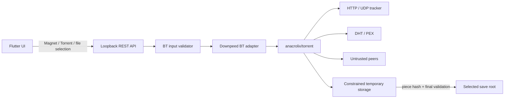

# BT/Magnet 威胁模型

版本：1.1
日期：2026-08-12
范围：Downpeed Go 内核中的 Torrent/Magnet 解析、元数据获取、Tracker/DHT/PEX、Peer 连接、分片写入、校验、上传和任务诊断。Flutter 只展示经过领域模型归一化的数据，不直接解析 Torrent 或建立 Peer 连接。

## 资产与信任边界

需要保护的资产包括用户选择的下载目录及目录外文件、磁盘空间、网络带宽、IP 地址与 BT 活动隐私、URL 中的 Tracker token、任务数据库、进程内存、文件描述符和应用可用性。

以下输入全部不可信：`.torrent` 字节、Magnet URI、显示名、文件路径、Tracker/WebSeed URL、DNS 结果、重定向、DHT 节点、PEX 地址、Peer 握手和消息、远端 metadata、文件尺寸和 Piece 哈希。即使数据来自本地文件或历史任务，也必须重新校验。

## 安全不变量

1. Torrent 中的任何名称都不能使写入越过用户已授权的绝对保存目录。
2. 未完成 Piece 不能出现在最终文件；最终发布前必须验证 Piece 哈希、选中文件边界和总尺寸。
3. 解析和网络输入必须有字节数、数量、时间、并发和地址范围上限。
4. 私有 Torrent 不得通过 DHT 或 PEX 泄露 InfoHash。
5. Tracker、WebSeed 和 Peer 不能被用来访问 Loopback、链路本地、私网、组播或其他受限地址，除非用户在独立高风险设置中明确允许本地 Tracker。
6. 暂停、取消、删除任务和关闭引擎后必须释放监听器、socket、goroutine、计时器和文件句柄。
7. 日志、通知、错误响应和诊断导出不得包含完整 Magnet、Tracker passkey、URL 凭据、Peer 原始消息或用户绝对路径。

## 输入限制

| 输入 | 首版硬上限 | 处理要求 |
| --- | ---: | --- |
| `.torrent` 文件 | 8 MiB | 使用 `io.LimitReader` 先限长再解析；超限拒绝 |
| Magnet URI | 8 KiB | 仅接受 `magnet:`；限制 query 参数总量并拒绝 NUL/控制字符 |
| 文件数量 | 10,000 | 超限拒绝，不在 Flutter 中构建无限节点 |
| 路径深度 | 32 层 | 每段和整体路径都校验 |
| 单路径段 | 255 UTF-8 bytes | 规范化后再次校验，处理平台保留名 |
| Tracker | 64 个 | 去重；单 URL 最大 2 KiB；只允许 `http`、`https`、`udp` |
| WebSeed | 0 个 | M3 默认禁用；启用前需独立 SSRF 审查 |
| 总声明大小 | 16 TiB | 创建任务前同时检查可用磁盘空间 |
| 单文件大小 | 8 TiB | 检查整数溢出、稀疏文件和平台文件系统限制 |
| Magnet metadata | 8 MiB / 120 秒 | 达到任一上限就取消所有相关连接 |

数值可以在后续版本向下配置，但提高硬上限必须更新本威胁模型并增加边界测试。所有大小累加使用带溢出检查的 `int64`/`uint64` 转换，不信任上游结构已经完成产品级限制。

## 路径与文件系统

- 对 Torrent v1 文件列表和 v2 文件树执行相同的重新遍历，不直接将上游拼接结果当作安全路径。
- 拒绝绝对路径、空段、`.`、`..`、NUL、路径分隔符混淆、Windows 盘符/UNC、设备名和尾随点/空格等平台危险形式。
- 对 Unicode 做稳定规范化并处理规范化后重名；跨平台冲突必须在创建任务前显示，而不是下载完成时覆盖。
- 保存根目录必须是用户明确选择的绝对目录。每个目标路径在创建和最终发布时都重新确认仍位于该根目录。
- 不跟随保存根下由外部程序替换的符号链接或重解析点；临时文件使用排他创建，最终文件使用不覆盖的原子发布策略。
- 临时文件与最终文件位于同一文件系统；取消清理未完成文件，暂停只保留经检查点确认的 Piece。
- 多文件 Torrent 只为用户选择的文件分配数据；相邻未选文件的共享 Piece 只能写入受控临时存储，不能发布为用户未选择的文件。
- 当前实现使用保存根目录下的隐藏 staging 目录；发布时通过目录作用域文件 API 重新检查 staging 不是符号链接，创建目标不覆盖现有文件，并只硬链接已校验的选中文件。staging 在校验和发布完成后清理，取消时也会清理。

## 网络、SSRF 与隐私

### 当前受限传输基线

M3 首个可下载版本只接受 `.torrent` 元数据和用户明确填写的公网 IPv4 Peer，不从 Torrent/Magnet 自动采用 Tracker、DHT node、PEX、WebSeed、HTTP metadata source 或嵌入 Peer。Tracker、DHT、PEX、WebSeed、IPv6、uTP、端口映射、入站连接、上传和自动做种均强制关闭；Magnet 仍只做身份解析。所有显式 Peer 在创建任务时规范化、去重并按本文件的受限地址策略过滤，任务最多 80 个 Peer。

引擎设置持久化 1–80 的每任务 Peer 连接预算，默认 80；预算在新任务创建时快照到任务协议状态，并同时约束 established 与 half-open 连接，后续设置变化不热切换运行中任务。设置 API 对发现、入站、IPv6、上传和做种实施 fail closed：任何开启值都被 `invalid_bt_policy` 拒绝，不能绕过 UI 解锁上游默认能力。

`anacrolix/torrent v1.61.0` 内置 HTTPS Tracker 客户端设置了 `InsecureSkipVerify: true`，因此当前版本禁止启用其自动 Tracker 路径。公共 Tracker 只有在 Downpeed 自行提供完成证书验证、重定向与地址过滤的适配器，或升级并重新审查已修复的上游版本后才能开放。

### Tracker 与 HTTP

- HTTP/HTTPS Tracker 使用 Downpeed 自有 `DialContext`：解析主机后逐个过滤 IP，并直接拨号到已验证地址，避免 DNS rebinding。
- 默认拒绝 Loopback、RFC1918、链路本地、未指定、组播、文档/基准网段以及 IPv4-mapped IPv6 的等价受限地址。
- 每次重定向重新校验 scheme、主机、端口和解析结果，最多 5 次；禁止从公网重定向到受限地址。
- UDP Tracker 在发送前执行相同地址过滤；响应事务 ID、来源地址和长度必须匹配请求。
- “允许本地 Tracker”是独立高风险开关，默认关闭，不从 Torrent metadata 自动开启。
- Tracker passkey 只保存在受保护任务数据中；日志只记录 origin 和不可逆标识，不记录完整 path/query。

### Peer、DHT 与 PEX

- 首版每任务最多 80 个已建立连接、20 个 half-open，进程全局最多 60 个 half-open；拨号、握手和失败 IP 接受速率均受限。
- `DisableAcceptRateLimiting` 必须为 `false`。握手、metadata 和空闲连接分别设置 deadline，不能由 Peer 无限续期。
- UPnP/NAT-PMP 默认关闭；不自动修改路由器端口映射。
- 公共 Torrent 可按用户设置启用 DHT/PEX；私有标记出现时强制关闭，历史状态恢复也必须重新应用。
- IPv6 首版关闭。开放前需实现与 IPv4 等价的受限地址分类、DNS rebinding 和集成测试。
- WebTorrent/WebRTC 默认关闭，避免引入 ICE/STUN/TURN 地址暴露与额外依赖面；WebSeed 默认关闭以收窄 SSRF 面。
- IP blocklist 和 Peer 地址去重在连接前生效；来自 Tracker、DHT、PEX 和 Magnet 的地址走同一过滤函数。

## 资源耗尽与滥用

- 同时解析 Torrent 的数量、解析队列和每用户批量创建数量沿用任务 API 限制，并额外限制 BT metadata 获取并发。
- `MaxUnverifiedBytes` 不高于 64 MiB；Piece 缓冲、Peer 消息、待验证写入和文件树节点均有独立上限。
- 不使用上游默认的无限上传。下载期间使用共享上传令牌桶；`Seed = false`，完成后默认停止上传，用户主动做种属于后续显式功能。
- 下载和上传限速、连接数、DHT 查询率、Tracker 重试均接入引擎级调度，失败采用有上限的退避，不形成请求风暴。
- 磁盘空间在创建任务和写入期间检查；达到预留阈值时暂停并给出可恢复错误，不继续稀疏分配到耗尽系统盘。
- 所有长生命周期操作持有任务 `context.Context`；测试暂停/取消后 goroutine、socket 和文件描述符回落到基线。

## 内容完整性与状态恢复

- InfoHash 与 metadata 必须匹配；Torrent v1 使用 SHA-1 Piece 校验，v2 使用协议规定的 Merkle/SHA-256 校验，不允许跳过初始或最终校验来换取速度。
- 从多个 Peer 得到的 metadata 在采用前完成哈希校验；失败 Peer 受惩罚且数据不进入文件树。
- 每个 Piece 只有在完整校验后才更新持久化完成位图；检查点包含 Torrent 身份、文件布局版本和选择集摘要。
- 恢复任务时重新校验临时文件大小、边界和必要 Piece；布局、选择或文件身份不一致时进入明确失败状态。
- 最终发布前验证所有选中文件的覆盖 Piece、总长度和目标路径，再 `Sync` 并原子发布；校验失败不会留下看似完成的最终文件。

## 日志、API 与界面

- Go 错误映射为稳定代码，例如 `bt_metadata_too_large`、`bt_path_unsafe`、`bt_private_address_blocked`、`bt_piece_hash_mismatch`，Flutter 不显示原始网络错误。
- BT 连接诊断只在用户主动展开后请求；普通 API 和 UI 只返回 `203.10.x.x:6881` 形式的 IPv4 `/16` 网络前缀与端口，IPv6、无端口或异常值统一返回 `Hidden`，不返回完整 Peer IP。
- 诊断只在任务正在下载时标记为 `live`；暂停、完成、失败、取消和恢复后不伪装实时连接。Peer 列表等短期连接数据仅保留在进程内存，不持久化到任务数据库。
- 诊断导出默认必须继续脱敏，不得因导出功能恢复完整 Peer IP。
- Magnet 仅显示安全 display name 和截断 InfoHash；Tracker 只显示 scheme/host，不显示 passkey。
- “开始 BT 下载”前提示上传、IP 可见性和内容合规边界；Downpeed 不内置资源搜索、推荐或侵权内容来源。

## 验证矩阵

| 类别 | 必测场景 |
| --- | --- |
| 解析 | 截断/递归/重复键 Bencode、8 MiB 边界、畸形 Magnet、v1/v2/hybrid |
| 路径 | `../`、绝对路径、UNC/盘符、NUL、Unicode 重名、Windows 设备名、符号链接替换 |
| 尺寸 | 文件数、深度、单文件、总大小边界及整数溢出 |
| SSRF | IPv4/IPv6 Loopback、私网、链路本地、DNS rebinding、跨域重定向、UDP Tracker |
| 隐私 | private Torrent 强制关闭 DHT/PEX；日志和错误不含 passkey/Magnet/绝对路径 |
| 完整性 | 错误 InfoHash、假 metadata、Piece 损坏、恢复时临时文件被替换 |
| 资源 | Peer/half-open/metadata 并发上限，慢连接、连接风暴、磁盘耗尽 |
| 生命周期 | 暂停、取消、删除、服务退出后释放网络和文件资源 |
| 配置 | UPnP、WebTorrent、WebSeed、IPv6、自动做种默认关闭，上传和接受连接有限速 |

解析器应增加固定回归样本和 Go fuzz target；网络测试使用本地可控 Tracker/Peer，不依赖公共 swarm。任何安全不变量被放宽时，先更新本文件、测试和用户可见设置，再修改适配器。
